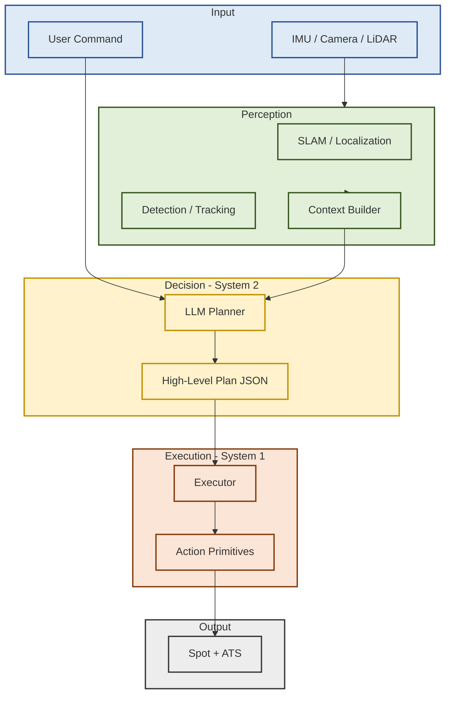
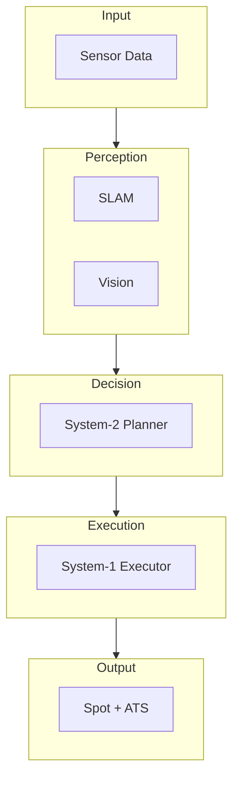

# RB_SpotATS_System

## System Validation Portfolio for Legged Robot Control (Spot + ATS)

---

## 전체 시스템 아키텍처

---

## 프로젝트 한 줄 요약

**RB_SpotATS_System**은
Isaac Sim / Isaac Lab 기반의 Spot + ATS 예제 레포지토리를 **포크(Fork)** 한 뒤,

> 로봇 제어 경험이 없는 상태에서
> 센서 → 상태 추정 → 제어 입력 → 실행(Action)으로 이어지는
> **로봇 제어 시스템 전체 구조를 이해하고 검증하기 위해**
> 코드를 분석하고, 실제로 실행하며, 실패를 재현·분해한
> **시스템 이해 및 실행 검증 중심 포트폴리오**입니다.

본 레포지토리는 **새로운 알고리즘이나 코드를 구현하는 것을 목표로 하지 않으며**,

- 제공된 시스템 코드가
- 어떤 역할 분담과 실행 흐름을 가지는지
- 실제 실행 환경에서 어디서 문제가 발생하고 왜 실패하는지

를 **실행 기반으로 해석할 수 있는지**에 초점을 둡니다.

---

## 프로젝트 배경

다족 로봇 제어(Spot 계열)에서 치명적인 문제의 대부분은
**제어 알고리즘 이전 단계**에서 발생합니다.

- IMU / Odometry / TF 불일치
- QoS 설정 오류로 인한 상태 미수신
- Clock / 실행 주기 / 노드 실행 순서 문제
- 센서 추가로 인한 질량·관성 구조 변화

본 프로젝트는 이러한 문제를

> Isaac Sim 기반 시스템 환경에서 **의도적으로 재현하고**,
> 실기체 관점에서 **어떤 지점이 실패로 이어지는지**를
> 실행 단위로 검증하는 것을 목표로 합니다.

---

## 시뮬레이션 활용 원칙 (중요)

Isaac Sim / Isaac Lab은 본 프로젝트에서

- 학습 도구 ❌
- 성능 비교 도구 ❌

가 아니라,

> **실기체 로봇 제어 시스템의 실행 구조를 사전에 검증하기 위한 대체 환경**

으로 사용되었습니다.

Action Graph + ROS 2 Bridge는 실기체 환경의

- 센서 드라이버
- MCU ↔ 메인 컴퓨터 인터페이스
- 상태 전달 및 제어 파이프라인

에 대응되는 구조로 해석됩니다.

---

## 전체 시스템 아키텍처

본 프로젝트는 **Spot 로봇에 ATS(Auto Targeting System)를 결합한 제어 시스템**을 대상으로,
**결정(Decision)과 실행(Execution)이 어떻게 분리되어 있는지**를
코드 구조와 실제 실행을 통해 분석했습니다.

### System 계층 개요

- **System‑0**: 센서·상태·물리 기반 시스템 정합성 검증
- **System‑1 (Executor)**: 계획된 행동을 실행 관점에서 안전하게 관리
- **System‑2 (Planner)**: 고수준 판단 및 계획 생성 (LLM 기반)

### 전체 아키텍처 다이어그램

> 본 아키텍처 다이어그램은
> 본 레포지토리에서 실제로 실행·분석한 코드 흐름을 기준으로
> **구조적 책임과 실행 경계를 재구성한 개념도**이며,
> 모든 블록이 동일한 수준으로 구현되었음을 의미하지는 않습니다.

---

## System‑2 Planner (구조 분석 및 실행 흐름 이해)

> System‑2는 로봇을 **직접 제어하지 않습니다.**

System‑2의 책임은 다음으로 제한됩니다.

- System‑1 상태(`/ats_state`) 및 컨텍스트 요약
- LLM 기반 High‑Level Plan(JSON) 생성
- 계획 스키마 검증 및 전달
- `report_and_wait` 상태에서 판단 갱신

---

## System‑1 Executor (구조 분석 및 실행 검증)

System‑1 Executor는 제어 정책이나 판단을 담당하지 않으며,
상위에서 전달된 계획을 **실행 관점에서 안정적으로 관리**하는 계층입니다.

- Plan(JSON) 수신 및 스키마 검증
- 실행 스레드 관리 및 execution generation 기반 취소 처리
- 단위 액션(Action Primitive) 실행 및 실패 감지
- 실행 상태(`/ats_state`) 퍼블리시를 통한 시스템 관측성 확보

---

## 주요 시스템 검증 및 트러블슈팅 사례

### TF / Frame 정합성 문제

- 현상: Navigation goal 설정 후 로봇 미동작
- 원인: ATS 추가 후 `map → odom → base_link` frame 구조 불일치
- 조치: static TF 재정의 및 TF publish 순서 조정
- 검증: RViz 상 TF 정상 연결 및 goal 도달 확인

### QoS 설정 불일치

- 현상: `/map` 토픽 미수신으로 localization 정지
- 원인: `transient_local` QoS 누락
- 조치: Subscriber QoS 명시적 설정
- 검증: map 정상 수신 및 SLAM 갱신 확인

### Clock / 실행 순서 문제

- 현상: Navigation 및 Executor 동작 정지
- 원인: Simulation Clock 미동기화 및 노드 실행 순서 오류
- 조치: `/clock` 확인 후 실행 순서 재정렬
- 검증: 전체 노드 정상 동작 확인

### 질량·관성 구조 변경에 따른 반응

- 현상: ATS 추가 후 동일 제어 입력에서 보행 불안정
- 조치: Isaac Sim에서 rigid body mass / inertia 속성 변경 후 비교 실행
- 검증: 구조 변경이 시스템 안정성에 미치는 영향 관찰

---

## 강화학습 레포지토리와의 관계

본 레포지토리는 **강화학습을 직접 다루지 않습니다.**

- 정책 학습 및 실험 운영은 별도의 레포지토리에서 수행되었습니다.

- **RL_SpotATS**: [https://github.com/myoungjelee/RL_SpotATS](https://github.com/myoungjelee/RL_SpotATS)

RB_SpotATS_System은 학습된 정책을 시스템 입력으로 통합하고,
**실제 실행 가능성과 안정성을 검증하는 단계**에 초점을 둡니다.

---

## 정리

이 프로젝트는

- Spot + ATS 로봇 시스템 예제 코드를 포크한 뒤
- 로봇 제어에 대한 사전 지식이 없는 상태에서
- 전체 시스템 실행 구조를 이해하고 검증하기 위해

센서, 상태, 통신, 실행 계층을 하나씩 분해하며
**실제 실행을 통해 검증한 시스템 중심 포트폴리오**입니다.

본 레포지토리는

- "내가 모든 코드를 구현했다"는 주장을 하지 않으며
- 기존 시스템을 **어떻게 실행했고, 무엇을 검증했고, 어떤 판단을 했는지**를

명확하게 설명하는 데 목적이 있습니다.

---

## 🔮 향후 확장 계획 (Future Work)

아래 항목은 현재 구조를 유지한 채
**아키텍처 수준에서 검토·설계 가능한 확장 방향**이며,
실제 구현 여부와는 무관하게 구조적 가능성을 기준으로 정리했습니다.

### 멀티로봇 관제 구조 확장

- **Robot Registry**: 복수 로봇 상태(heartbeat / 실행 상태)의 통합 관측
- **Task Allocation**: 로봇 상태 기반 작업 분배 및 우선순위 결정
- **Conflict Handling**: 동일 목표/공간 접근 시 충돌 상황 식별 및 룰 기반 조정
- **ROS 2 Namespace 기반 독립 실행**: 로봇별 실행 컨텍스트 분리 및 재사용성 확보
